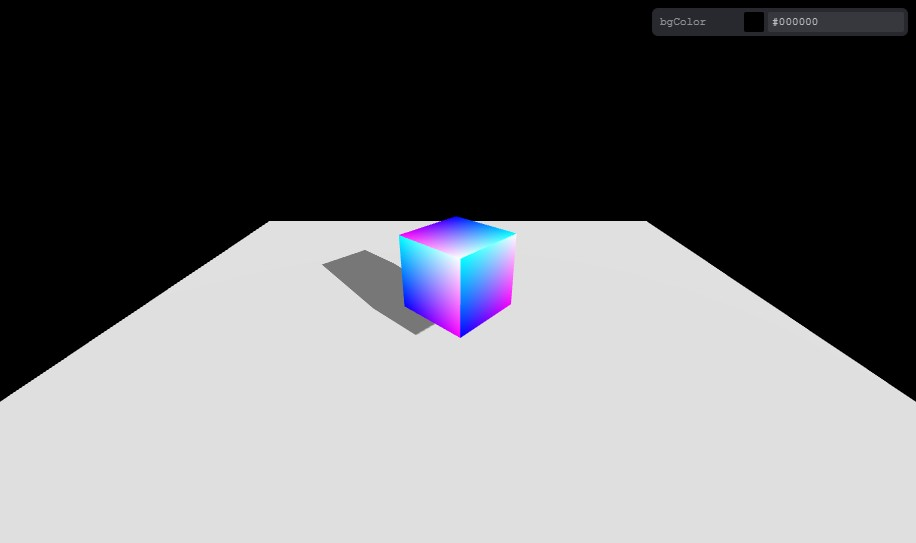

<p align='center'>
  
</p>

<h6 align='center'>
<a href="https://kai2128.github.io/threejs-starter">Live Demo</a>
</h6>

<h5 align='center'>
<b>Basic Three JS starter</b>
</h5>

<br>

- [Vite](https://vitejs.dev/)

- [TypeScript](https://www.typescriptlang.org/)
  
- [ESLint](https://eslint.org/)

- [mitt](https://www.npmjs.com/package/mitt/v/1.0.1) event emitter

- [Tweakpane](https://cocopon.github.io/tweakpane/)

## Quick Start

### GitHub Template

[Create a repo from this template on GitHub](https://github.com/kai2128/threejs-starter/generate).

### Clone to local

```bash
npx degit kai2128/threejs-starter
cd project-folder-name
pnpm i # If you don't have pnpm installed, run: npm install -g pnpm
```

### Development

delete `.github ` folder after cloning

```bash
pnpm run dev
```